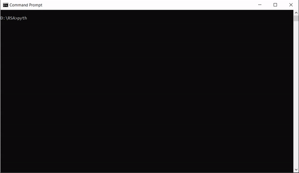

# RSA-Encryption-Algorithm-in-Python

This is a Python3 implementation to the [RSA Encryption Algorithm](https://en.wikipedia.org/wiki/RSA_(cryptosystem)) using the Extended Euclidean algorithm (also known as extended gcd).

## Usage

## Implementation Note

The prime numbers generated (p, q) are ranged from 100 to 500 only for demo purposes while they should be very large primes like 1024 or 2048 bits long for more complex encryption - [Read more about the RSA Factoring Challenge.](https://en.wikipedia.org/wiki/RSA_Factoring_Challenge)
